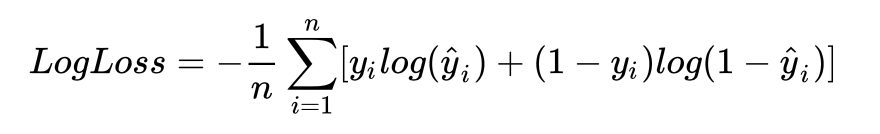

# Machine Learning Engineer Nanodegree
## Capstone Proposal
顾飞 优达学城  
2019年03月20日

## Proposal
-    Transfer Learning
-    Amazon Web Service 
-    Domain Background
-    Problem Statement
-    Datasets and Inputs
-    Datasets Analysis
-    Solution Statement
-    Benchmark Model
-    Evaluation Metrics
-    Project Design

### Transfer Learning
迁移学习是计算机视觉中一种备受欢迎的学习方法，通过迁移学习，我们可以在省时的基础上建立准确的模型。进行迁移学习时，你可以从解决不同问题时遇到的已知的模式开始学习，而不需要从头开始。这样你可以利用以前学到的知识，避免从头开始。迁移学习可视作沙特尔所说的“站在巨人的肩膀上”的深度学习版本。

在计算机视觉中，迁移学习通常通过使用预训练模型来实现。预训练模型指在大型基准数据集上进行问题解决训练的模型，而用于训练的问题与我们实际想要解决的问题类似。由于训练这类模型的计算量与计算成本低，更常见的应用是在已出版的文献中导入和使用这类模型。

从深度学习的角度来看，图像分类问题可以通过迁移学习来解决。实际上，图像分类中几项最新的研究成果都是基于迁移学习方案得出的。迁移学习，就是把在某个领域获取的知识迁移到对另一个领域的学习中。传统的机器学习，尤其是有监督学习，对数据的样本数量、数据分布的统一性、标签的完整性等都有着严苛的要求。而迁移学习解决的正是在机器学习任务中面对样本不足、标签不全等情况，如何借助外部其他分布的数据来有效地学习这一问题。

在图像识别问题中，是将训练好的模型通过简单调整来解决新的问题。从图像中提取特征，不一定需要算力强大的GPU，训练上百层的神经网络。

卷积神经网络中卷积层和池化层可以抽取图片的几何特征，比如浅层的卷积用于抽取出一些直线，角点等简单的抽象信息，深层的卷积层用于抽取人脸等复杂的抽象信息，最后的全连接层是对图片分类的处理。因此，我们可以使用网络的前N-1层提取特征。

例如，利用在 ImageNet 数据集上训练好的 ResNet50 模型来解决一个自定义的图像分类问题：保留训练好的 ResNet50 模型中卷积层的参数，只去掉最后一个全连接层，将新图像输入训练好的神经网络，利用前N-1层的输出作为图片的特征，将 ResNet50 模型作为图片特征提取器，提取得到的特征向量作为输入训练新的单层全连接网络来处理新的分类问题，或者将这些特征代入SVM，LR等其它机器学习模型进行训练和预测。

在数据量足够的情况下，迁移学习的效果往往不如完全重新训练，但是迁移学习所需要的训练时间和训练样本要远远小于训练完整的模型。

### Amazon Web Service 

由于此项目要求的计算量较大，也许你能够在本地 CPU 上训练。训练过程可能持续几个小时，取决于迭代次数、神经网络的大小和其他因素。

一种更快速的方法是在 GPU (图形处理器)上进行训练。虽然 CPU 可以比 GPU 计算更复杂的运算，但是吞吐量较小。因此在训练神经网络时，GPU 比 CPU 的速度要快很多。GPU 在同一时间会执行更多的计算，当我们处理大数据时这很重要。

你也可以自己购买 NVIDIA GPU，但是并非像将 GPU 插入机器那么简单。即使你知道如何安装 GPU，但是正确地安装 cuDNN 还是有一定的挑战。因此，我们不建议这么使用 GPU。

我们建议使用 Amazon EC2 实例，使用 Amazon p3.2xlarge 云服务器来完成该项目。

PS：如果你不想自己从头开始训练模型，重复造轮子。也可以使用预训练模型，提高训练准确度。

### Domain Background
[Dogs vs. Cats Redux: Kernels Edition](https://www.kaggle.com/c/dogs-vs-cats-redux-kernels-edition)


项目来源于 kaggle 在 2013 年组织的一场比赛，它使用25000张（约543M）猫狗图片作为训练集，12500张(约271M)图片作为测试集，数据都是分辨率400x400左右的小图片，目标是识别测试集中的图片是猫还是狗。赛题网址：https://www.kaggle.com/c/dogs-vs-cats。

目前 Leaderboard 上展示了 1314 支队伍的成绩，排名第一的 score 是 0.03302，Top2% 的成绩是 0.04357。本项目的最低要求是 kaggle Public Leaderboard 前 10%，即 0.06149。

### Problem Statement
深度学习中最突出的问题之一是图像分类。图像分类的目的是根据潜在的类别对特定的图像进行分类。图像分类的一个经典示例是在一组图像中识别猫和狗。

本文将介绍如何在图像分类问题中实施迁移学习解决方案。主要是使用"监督学习”实现一个图像分类器，来识别一张图片是猫还是狗。

对于图像识别，在数据量足量大的情况下，一般使用深度学习中的卷积神经网络（Convolutional Neural Networks, CNN），而本文将从迁移学习的角度，看看如何应用现有的深度学习模型（ResNet50、InceptionV3 和 Xception），从图片中提取特征，供分类器使用。使用此方法，即无需大量学习和训练模型的时间成本，又能解决图片识别相关的大多数问题。

本项目需要对测试样本进行分类，然后基于 CNN 的模型进行训练，并将结果上传至 kaggle 进行评分。

### Datasets and Inputs
此数据集可以从 kaggle 上下载。[Dogs vs. Cats Redux: Kernels Edition](https://www.kaggle.com/c/dogs-vs-cats-redux-kernels-edition/data)


下载 kaggle 猫狗数据集解压后分为 3 个文件 train.zip、 test.zip 和 sample_submission.csv。

train 训练集包含了 25000 张猫狗的图片，猫狗各一半，每张图片包含图片本身和图片名。命名规则根据 “type.num.jpg” 方式命名。

test 测试集包含了 12500 张猫狗的图片，没有标定是猫还是狗，每张图片命名规则根据 “num.jpg”，需要注意的是测试集编号从 1 开始，而训练集的编号从 0 开始。

sample_submission.csv 需要将最终测试集的测试结果写入.csv 文件中，上传至 kaggle 进行打分。

### Datasets Analysis
在做计算机视觉的任务时，第一步很重要的事情是看看要做的是什么样的数据集，是非常干净的？还是存在各种遮挡的？猫和狗是大是小？图片清晰度一般怎么样？会不会数据集中有标注错误的数据，比例是多少？
此数据集由 kaggle 提供，数据集还是比较干净的，通过抽样的方式随机抽样观察，大多数的图片都大于260px，正常图片尺寸都在440px左右，分辨率也比较清晰。
当然对于大数据集，我们无法简单抽样分辨的可以通过opencv，找出模糊图片，原理就是使用了cv2.Laplacian()这个方法，代码如下。图片越模糊，imageVar的值越小，图像越模糊。
参考代码：来源于：https://blog.csdn.net/u014642834/article/details/78532798

```
#-*-coding:utf-8-*-
import sys
reload(sys)
sys.setdefaultencoding('utf-8')
import os
import cv2
import shutil
 
THRESHOLD = 30.0
 
dst_root = r'/media/unionpay/0009FFAB000A9861/CASIA&KFZX_CLEAR'
for fpath, dirs, fs in os.walk('/media/unionpay/0009FFAB000A9861/CASIA&KFZX'):
 i = 0
 for dir in dirs:
  i += 1
  if i%100 == 0:
   print (str(i)+'folders processed current:'+dir)
  abs_dir = os.path.join(fpath, dir)
  for _, __, fs in os.walk(abs_dir):
   clear_img_list = []
   for f in fs:
    item = os.path.join(_, f)
    image = cv2.imread(os.path.join("/media/unionpay/0009FFAB000A9861/CASIA&KFZX/0000447", item))
    gray = cv2.cvtColor(image, cv2.COLOR_BGR2GRAY)
    imageVar = cv2.Laplacian(gray, cv2.CV_64F).var()
    if not imageVar < THRESHOLD:
     clear_img_list.append(item)
   dst_folder = os.path.join(dst_root, dir)
   if len(clear_img_list) >= 15:
    if not os.path.exists(dst_folder):
     os.mkdir(dst_folder)
    for item in clear_img_list:
     dst_path = os.path.join(dst_folder, item.split('/')[-1])
     shutil.copy(item, dst_path)
```

### Solution Statement
为了提高模型的表现，本项目决定使用预训练网络，最终选择了ResNet50, Xception, Inception V3 这三个模型，每个模型导出的时间都挺长。 这三个模型都是在 ImageNet 上面预训练过的，所以每一个模型都可以说是身经百战。我们可以将多个不同的网络输出的特征向量先保存下来，后续即使是在普通笔记本上也能轻松训练。

有了三个特征向量后，我们需要将这三条向量进行合并成一条特征向量。

### Benchmark Model
模型构建时，设置 dropout = 0.5，激活函数：Sigmoid，优化器为 Adadelta。

### Evaluation Metrics
对数损失（Log loss）亦被称为逻辑回归损失（Logistic regression loss）或交叉熵损失（Cross-entropy loss）。 交叉熵是常用的评价方式之一，它实际上刻画的是两个概率分布之间的距离，是分类问题中使用广泛的一种损失函数。
本文实际上是二分类问题， 因此可以采用 logloss 损失函数作为评价指标， 计算公式如下：



其中：

- n 是测试集中图片数量
- $$\hat{y}$$ 是图片预测为狗的概率
- $$y_i$$如果图像是狗，则为1，如果是猫，则为0
- $$\log( )$$ 是自然（ 基数$$^e$$）对数

采用交叉熵作为损失函数可以有效的解决梯度消失和梯度爆炸的问题。
交叉熵损失越小，代表模型的性能越好。上述评估指标可用于评估该项目的解决方案以及基准模型。

### Project Design
数据预处理：
由于我们的数据集的文件名是以 type.num.jpg 这样的方式命名，如 cat.0.jpg，但是使用 Keras 的 ImageDataGenerator 需要将不同种类的图片分在不同的文件夹中，因此我们需要对数据集进行预处理。这里我们采取的思路是创建符号链接(symbol link)，优点是不用复制一遍图片，占用不必要的空间。

```
train_list = os.listdir('train')

train_cat = filter(lambda x:x[:3] == 'cat', train_list)
train_dog = filter(lambda x:x[:3] == 'dog', train_list)

def mkdir(path):
    folder = os.path.exists(path)
    if folder:
        shutil.rmtree(path)
    os.mkdir(path)

train_symlink_path = 'train-symlink'
test_symlink_path = 'test-symlink'
    
mkdir(train_symlink_path)

os.mkdir(train_symlink_path + '/cat')
for filename in train_cat:
    os.symlink('../../train/' + filename, train_symlink_path + '/cat/' + filename)

os.mkdir(train_symlink_path + '/dog')
for filename in train_dog:
    os.symlink('../../train/' + filename, train_symlink_path + '/dog/' + filename)

mkdir(test_symlink_path)
os.symlink('../test/', test_symlink_path + '/test')
```
导出特征向量：
```
def write_gap(MODEL, image_size, lambda_func=None):
    input_tensor = Input(shape=(image_size[0], image_size[1], 3))
    x = input_tensor
    if lambda_func:
        x = Lambda(lambda_func)(x)
         
    base_model = MODEL( include_top=False, weights='imagenet', input_tensor=x)
    model = Model(base_model.input, GlobalAveragePooling2D()(base_model.output))

    gen = ImageDataGenerator()
    train_generator = gen.flow_from_directory("train-symlink", image_size, shuffle=False, 
                                              batch_size=32)
    test_generator = gen.flow_from_directory("test-symlink", image_size, shuffle=False, 
                                             batch_size=32, class_mode=None)

    train = model.predict_generator(train_generator, math.ceil(train_generator.samples*1.0/train_generator.batch_size), verbose=1)
    test = model.predict_generator(test_generator, math.ceil(test_generator.samples*1.0/test_generator.batch_size), verbose=1)
    
    if MODEL==ResNet50:
        model_name = "gap_ResNet50.h5"
    elif MODEL==Xception:
        model_name = "gap_Xception.h5"
    elif MODEL==InceptionV3:
        model_name = "gap_InceptionV3n.h5"
    with h5py.File(model_name) as h:
        h.create_dataset("train", data=train)
        h.create_dataset("test", data=test)
        h.create_dataset("label", data=train_generator.classes)
        
write_gap(ResNet50, (224, 224))
write_gap(Xception, (299, 299), xception.preprocess_input)
write_gap(InceptionV3, (299, 299), inception_v3.preprocess_input)
```
合并特征向量：
```
np.random.seed(2019)

X_train = []
X_test = []

for filename in ["gap_ResNet50.h5", "gap_Xception.h5", "gap_InceptionV3.h5"]:
    with h5py.File(filename, 'r') as h:
        X_train.append(np.array(h['train']))
        X_test.append(np.array(h['test']))
        y_train = np.array(h['label'])

X_train = np.concatenate(X_train, axis=1)
X_test = np.concatenate(X_test, axis=1)

X_train, y_train = shuffle(X_train, y_train)
```
模型构建：
```
input_tensor = Input(X_train.shape[1:])
x = Dropout(0.5)(input_tensor)
x = Dense(1, activation='sigmoid')(x)
model = Model(input_tensor, x)

model.compile(optimizer='adadelta',
              loss='binary_crossentropy',
              metrics=['accuracy'])
```

迁移学习的神经网络结果如下图：


模型训练：

```
fit = model.fit(X_train, y_train, batch_size=128, epochs=8, validation_split=0.2, verbose=1)
print(fit.history)
```
预测测试集：
```
y_pred = model.predict(X_test, verbose=2)
y_pred = y_pred.clip(min=0.005, max=0.995)
```
```
df = pd.read_csv("sample_submission.csv")

gen = ImageDataGenerator()
test_generator = gen.flow_from_directory("test-symlink", (224, 224), shuffle=False,
                                         batch_size=32, class_mode=None)

for i, fname in enumerate(test_generator.filenames):
    index = int(fname[fname.rfind('/')+1:fname.rfind('.')])
    df.set_value(index-1, 'label', y_pred[i])

df.to_csv('pred.csv', index=None)

df.head(10)
```
