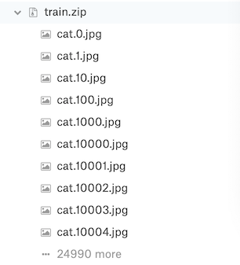
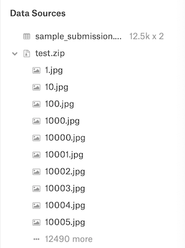
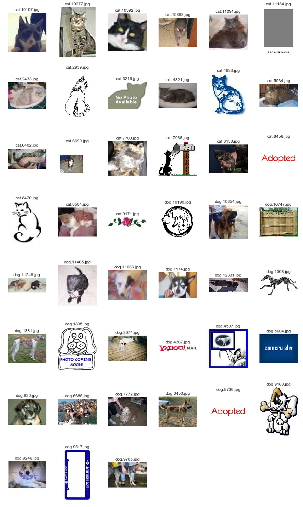
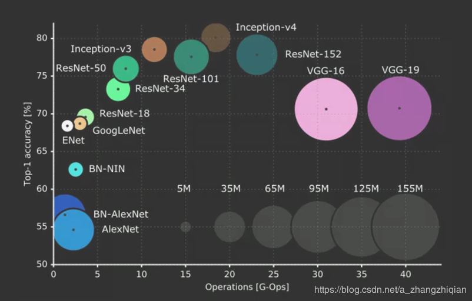
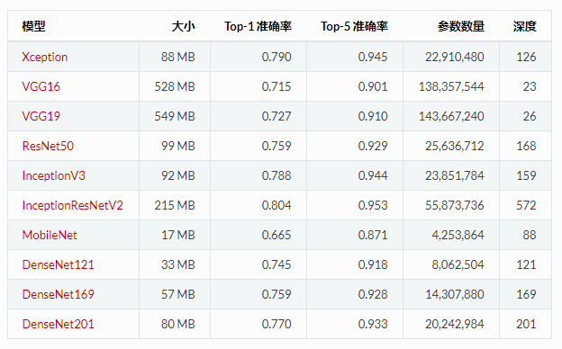
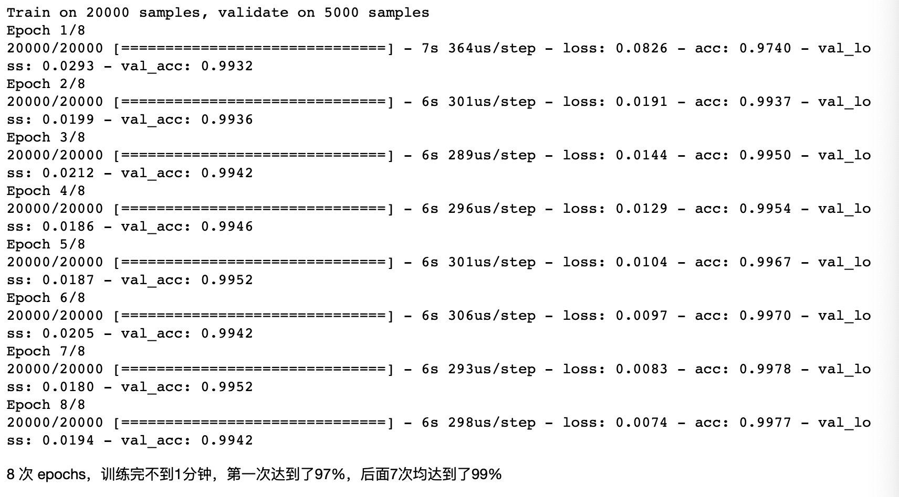
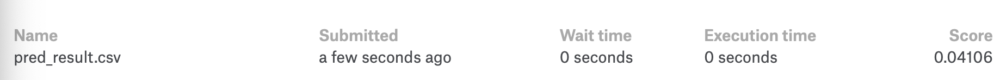
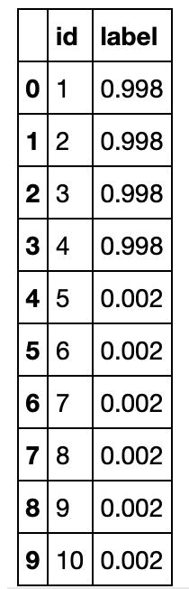

# 机器学习纳米学位
##毕业项目
 Fei.Gu 优达学城

2019年04月20日


## I. 问题的定义

### 项目概述

项目来源于 kaggle 在 2013 年组织的一场比赛，它使用25000张（约543M）猫狗图片作为训练集，12500张(约271M)图片作为测试集，数据都是分辨率400x400左右的小图片，目标是识别测试集中的图片是猫还是狗。

本项目属于计算机视觉中的图像分类问题。图像分类的目的是根据潜在的类别对特定的图像进行分类。图像分类的一个经典示例是在一组图像中识别猫和狗。

赛题网址：https://www.kaggle.com/c/dogs-vs-cats

数据集下载地址：[Dogs vs. Cats Redux: Kernels Edition](https://www.kaggle.com/c/dogs-vs-cats-redux-kernels-edition)


### 问题陈述
本文将介绍如何在图像分类问题中实施迁移学习解决方案。主要是使用"监督学习”实现一个图像分类器，来识别一张图片是猫还是狗。

对于图像识别，在数据量足量大的情况下，一般使用深度学习中的卷积神经网络（Convolutional Neural Networks, CNN），而本文将从迁移学习的角度，看看如何应用现有的深度学习模型（ResNet50、InceptionV3 和 Xception），从图片中提取特征，供分类器使用。使用此方法，即无需大量学习和训练模型的时间成本，又能解决图片识别相关的大多数问题。

本项目需要对测试样本进行分类，然后基于 CNN 的模型进行训练，并将结果上传至 kaggle 进行评分。

### 评价指标
对数损失（Log loss）亦被称为逻辑回归损失（Logistic regression loss）或交叉熵损失（Cross-entropy loss）。 交叉熵是常用的评价方式之一，它实际上刻画的是两个概率分布之间的距离，是分类问题中使用广泛的一种损失函数。
本文实际上是二分类问题， 因此可以采用 logloss 损失函数作为评价指标， 计算公式如下：


其中：

- n 是测试集中图片数量
- $$\hat{y}$$ 是图片预测为狗的概率
- $$y_i$$如果图像是狗，则为1，如果是猫，则为0
- $$\log( )$$ 是自然（ 基数$$^e$$）对数

采用交叉熵作为损失函数可以有效的解决梯度消失和梯度爆炸的问题。
交叉熵损失越小，代表模型的性能越好。上述评估指标可用于评估该项目的解决方案以及基准模型。


## II. 分析
### 数据的探索
此数据集可以从 kaggle 上下载。[Dogs vs. Cats Redux: Kernels Edition](https://www.kaggle.com/c/dogs-vs-cats-redux-kernels-edition/data)




下载 kaggle 猫狗数据集解压后分为 3 个文件 train.zip、 test.zip 和 sample_submission.csv。

train 训练集包含了 25000 张猫狗的图片，猫狗各一半，每张图片包含图片本身和图片名。命名规则根据 “type.num.jpg” 方式命名。

test 测试集包含了 12500 张猫狗的图片，没有标定是猫还是狗，每张图片命名规则根据 “num.jpg”，需要注意的是测试集编号从 1 开始，而训练集的编号从 0 开始。

sample_submission.csv 需要将最终测试集的测试结果写入.csv 文件中，上传至 kaggle 进行打分。

### 探索性可视化
在做计算机视觉的任务时，第一步很重要的事情是看看要做的是什么样的数据集，是非常干净的？还是存在各种遮挡的？猫和狗是大是小？图片清晰度一般怎么样？会不会数据集中有标注错误的数据，比例是多少？

- train 训练集包含了 25000 张猫狗的图片，平均宽=404px，平均高=360px，最小的宽=42px，最大宽=1050px，最小高=32px，最大高=768px；
- test 测试集包含了 12500 张猫狗的图片，平均宽=404px，平均高=359px，最小的宽=37px，最大宽=500px，最小高=44px，最大高=500px；
- 还可以通过opencv，找出模糊图片，原理就是使用了cv2.Laplacian()这个方法，代码如下。图片越模糊，imageVar的值越小，图像越模糊。

通过对图片中的色彩像素比进行 IQR 分析，发现了一些低分辨率（小于100px）和无关的图片（非猫和狗）：

对于训练集来说，这些异常数据是要剔除掉的。

### 算法和技术

在计算机视觉领域，一般使用深度学习中的卷积神经网络（Convolutional Neural Networks, CNN），去解决图像识别问题，常见的卷积神经网络架构如下：


卷积神经网络中卷积层和池化层主要是对图片的几何特征进行抽取，然后全连接层对图片分类进行处理。输入层、卷积层、输出层的结构及其对应的参数就构成了一个典型的卷积神经网络。
我们可以利用已经训练好的卷积神经网络提取图片中复杂的几何特征，即将原始图片用已经训练好的卷积神经网络处理之后的输出，作为新的输入，然后加上自己的全连接层，去进行分类。在模型训练的过程中，只改变新加的全连接层的权重。
总的来说，卷积神经网络是一种特殊的神经网络结构，即通过卷积操作可以实现对图像特征的自动学习，选取那些有用的视觉特征以最大化图像分类的准确率。

自 2012 年的 ImageNet 比赛起，几乎每一年都会有新的网络结构诞生，已经被大家认可的常见网络有 AlexNet, VGG-Net, GoogLeNet, Inception V2-V4, ResNet 等。这些卷积神经网络都是在 ImageNet 数据集上表现非常优异的神经网络，具体准确率和模型大小如下图所示。


由于每一种神经网络提取的特征都不一样，因此本项目将多个神经网络处理的结果拼接，作为最后一层全连接层的输入，这样做可以有效地降低方差。

本项目迁移学习部分使用 Keras 实现，而 Keras 中可以导入的模型有 Xception，VGG16，VGG19，ResNet50，InceptionV3，InceptionResNet -V2，MobileNet. 综合考虑模型的分类准确率和大小，选用迁移学习的基础模型为 ResNet50，InceptionV3 和 Xception。

迁移学习是一种机器学习技术，即我们可以将一个领域的知识（比如 ImageNet）应用到目标领域，从而可以极大减少所需要的数据点。在实践中，这通常涉及到使用来自 ResNet、Inception 等的预训练的权重初始化模型，然后要么将其用作特征提取器，要么就在一个新数据集上对最后几层进行微调。使用迁移学习，这些模型可以在任何我们想要执行的相关任务上得到重新利用。

**ResNet**

ResNet 诞生于一个美丽而简单的观察：为什么非常深度的网络在增加更多层时会表现得更差？

直觉上推测，更深度的网络不会比更浅度的同类型网络表现更差吧，至少在训练时间上是这样（当不存在过拟合的风险时）。让我们进行一个思想实验，假设我们已经构建了一个 n 层网络，并且实现了一定准确度。那么一个 n+1 层网络至少也应该能够实现同样的准确度——只要简单复制前面 n 层，再在最后一层增加一层恒等映射就可以了。类似地，n+2、n+3 和 n+4 层的网络都可以继续增加恒等映射，然后实现同样的准确度。但是在实际情况下，这些更深度的网络基本上都会表现得更差。

ResNet 的作者将这些问题归结成了一个单一的假设：直接映射是难以学习的。而且他们提出了一种修正方法：不再学习从 x 到 H(x) 的基本映射关系，而是学习这两者之间的差异，也就是「残差（residual）」。然后，为了计算 H(x)，我们只需要将这个残差加到输入上即可。

假设残差为 F(x)=H(x)-x，那么现在我们的网络不会直接学习 H(x) 了，而是学习 F(x)+x。

这就带来了你可能已经见过的著名 ResNet（残差网络）模块：


ResNet 模块

ResNet 的每一个「模块（block）」都由一系列层和一个「捷径（shortcut）」连接组成，这个「捷径」将该模块的输入和输出连接到了一起。然后在元素层面上执行「加法（add）」运算，如果输入和输出的大小不同，那就可以使用零填充或投射（通过 1×1 卷积）来得到匹配的大小。

ResNet 是神经网络领域我个人最喜欢的进展之一。很多深度学习论文都是通过对数学、优化和训练过程进行调整而取得一点点微小的进步，而没有思考模型的底层任务。ResNet 则从根本上改变了我们对神经网络及其学习方式的理解。

**Inception**

如果 ResNet 是为了更深，那么 Inception 家族就是为了更宽。Inception 的作者对训练更大型网络的计算效率尤其感兴趣。Inception 的第一个版本是 GoogLeNet，也就是前面提及的赢得了 ILSVRC 2014 比赛的 22 层网络。一年之后，研究者在第二篇论文中发展出了 Inception v2 和 v3，并在原始版本上实现了多种改进——其中最值得一提的是将更大的卷积重构成了连续的更小的卷积，让学习变得更轻松。比如在 v3 中，5×5 卷积被替换成了两个 连续的 3×3 卷积。

Inception 很快就变成了一种具有决定性意义的模型架构。最新的版本 Inception v4 甚至将残差连接放进了每一个模组中，创造出了一种 Inception-ResNet 混合结构。但更重要的是，Inception 展现了经过良好设计的「网中有网」架构的能力，让神经网络的表征能力又更上了一层楼。

**Xception**

Xception 表示「extreme inception」。和前面两种架构一样，它重塑了我们看待神经网络的方式——尤其是卷积网络。而且正如其名字表达的那样，它将 Inception 的原理推向了极致。

它的假设是：「跨通道的相关性和空间相关性是完全可分离的，最好不要联合映射它们。」

这是什么意思？在传统的卷积网络中，卷积层会同时寻找跨空间和跨深度的相关性。让我们再看一下标准的卷积层：


在上图中，过滤器同时考虑了一个空间维度（每个 2×2 的彩色方块）和一个跨通道或「深度」维度（4 个方块的堆叠）。在输入图像的输入层，这就相当于一个在所有 3 个 RGB 通道上查看一个 2×2 像素块的卷积过滤器。那问题来了：我们有什么理由去同时考虑图像区域和通道？

在 Inception 中，我们开始将两者稍微分开。我们使用 1×1 的卷积将原始输入投射到多个分开的更小的输入空间，而且对于其中的每个输入空间，我们都使用一种不同类型的过滤器来对这些数据的更小的 3D 模块执行变换。Xception 更进一步。不再只是将输入数据分割成几个压缩的数据块，而是为每个输出通道单独映射空间相关性，然后再执行 1×1 的深度方面的卷积来获取跨通道的相关性。


### 基准模型
目前 Leaderboard 上展示了 1314 支队伍的成绩，排名第一的 score 是 0.03302，Top2% 的成绩是 0.04357。本项目的最低要求是 kaggle Public Leaderboard 前 10%，即 0.06149。

## III. 方法

### 数据预处理
一些神经网络中会提到ImageNet Top-5 或者Top-1，这是一种图片检测准确率的标准。

Top-5错误率

即对一个图片，如果概率前五中包含正确答案，即认为正确。

Top-1错误率

即对一个图片，如果概率最大的是正确答案，才认为正确。



使用 InceptionV3 模型排查出的需要剔除的图片有45张，如下图展示：


数据集清洗后，猫的数量：12479，狗的数量：12476，测试集图片数量：12500。
由于我们的数据集的文件名是以 type.num.jpg 这样的方式命名的，比如 cat.0.jpg，但是使用 Keras 的 ImageDataGenerator 需要将不同种类的图片分在不同的文件夹中，因此我们需要对数据集进行预处理。这里我们采取的思路是创建符号链接(symbol link)，这样的好处是不用复制一遍图片，占用不必要的空间。
文件目录结构如下：

```
./
├── test 
├── test-symlink
│   ├── test -> ../test/
├── train 
├── train-symlink
│   ├── cat 
│   └── dog 
```

### 执行过程
#### 特征向量生成
- Xception 和 InceptionV3 默认输入图片大小是 299*299，ResNet50 默认输入图片大小是 224*224；

- Xception 和 InceptionV3 默认输入数值在 (-1, 1) 范围内。当要输入与默认图片大小不同的图片时，只需传入当前图片大小即可。ResNet50 需要对图片进行中心化处理，由于载入的 ResNet50 模型是在 ImageNet 数据上训练出来的，所以在预处理中每个像素点都要减去 ImageNet 均值。

在 Keras 中载入模型并进行全局平均池化，只需要在载入模型的时候，设置 include_top=False, pooling='avg'.。每个模型都将图片处理成一个  1*2048 的行向量，将这三个行向量进行拼接，得到一个 1*6144 的行向量，作为数据预处理的结果。

```
"""
定义通用函数
入参：模型、输入图片的大小、预处理函数
"""
def write_gap(MODEL, image_size, lambda_func=None):
    input_tensor = Input(shape=(image_size[0], image_size[1], 3))
    x = input_tensor
    if lambda_func:
        x = Lambda(lambda_func)(x)
         
    base_model = MODEL( include_top=False, weights='imagenet', input_tensor=x)
    model = Model(base_model.input, GlobalAveragePooling2D()(base_model.output))

    train_datagen = ImageDataGenerator(
            rescale=1./255,
            shear_range=0.2,
            zoom_range=0.2,
            horizontal_flip=True)

    # 用于测试的增强配置
    test_datagen = ImageDataGenerator(rescale=1./255)

    # 定义了两个 generator
    # 读取在train中找到的图片，并无限期地生成大量的增强图像数据
    train_generator = train_datagen.flow_from_directory(
                                              "train-symlink", 
                                              target_size = image_size, 
                                              shuffle=False, 
                                              batch_size=32,
                                              class_mode='binary')
    
    test_generator = test_datagen.flow_from_directory(
                                             "train-symlink", 
                                             target_size = image_size, 
                                             shuffle=False, 
                                             batch_size=32, 
                                             class_mode='binary')

    # 导出特征向量
    train = model.predict_generator(train_generator, 
                                    math.ceil(train_generator.samples*1.0/train_generator.batch_size), 
                                    verbose=1)
    test = model.predict_generator(test_generator, 
                                   math.ceil(test_generator.samples*1.0/test_generator.batch_size), 
                                   verbose=1)
    
    # 此项目选择了：ResNet50, Xception, InceptionV3 这三个模型
    if MODEL == ResNet50:
        model_name = "gap_ResNet50.h5"
    elif MODEL == Xception:
        model_name = "gap_Xception.h5"
    elif MODEL == InceptionV3:
        model_name = "gap_InceptionV3.h5"
        
    with h5py.File(model_name) as h:
        h.create_dataset("train", data=train)
        h.create_dataset("test", data=test)
        h.create_dataset("label", data=train_generator.classes)
```

### 载入特征向量
现在我们获得了3个特征向量文件：
gap_ResNet50.h5
gap_Xception.h5
gap_InceptionV3.h5
把三个模型合并在一起，每个图片就有2048*3个权重值
```
np.random.seed(2019)

X_train = []
X_test = []

for filename in ["gap_ResNet50.h5", "gap_Xception.h5", "gap_InceptionV3.h5"]:
    with h5py.File(filename, 'r') as h:
        X_train.append(np.array(h['train']))
        X_test.append(np.array(h['test']))
        y_train = np.array(h['label'])

X_train = np.concatenate(X_train, axis=1)
X_test = np.concatenate(X_test, axis=1)

X_train, y_train = shuffle(X_train, y_train)
```
#### 构建模型
载入预处理的数据之后，先进行一次概率为 0.25 的 dropout，然后直接连接输出层，激活函数为 Sigmoid，优化器为 Adadelta，输出一个零维张量，表示某张图片中有狗的概率
```
inputs = Input(X_train.shape[1:])
x = Dropout(0.25)(inputs)
x = Dense(1, activation='sigmoid')(x)
model = Model(inputs, x)

model.compile(optimizer='adadelta', 
              loss='binary_crossentropy', 
              metrics=['accuracy'])
```
#### 训练模型
```
fit = model.fit(X_train, y_train, batch_size=128, epochs=8, validation_split=0.2, verbose=1)
```
#### 保存模型
```
model.save('model.h5')
```
### 完善
- 本项目通过色彩-像素比进行 IQR 分析来剔除异常图片，并不能找出所有异常图片，比如遮挡、猫狗占图片的总面积等，这些都没有完全剔除来。后期可以试试从图片模糊、旋转、裁剪等角度去提升
- 通过对模型参数的优化，选择不同的优化器，去尝试优化的结果

## IV. 结果
### 模型的评价与验证


Kaggle 得分：0.04106，leaderboard 18 / 1314。

### 合理性分析
Xception，InceptionV3 和 ResNet50 这三个模型进行组合迁移学习，效果比先单个神经网络模型效果好。更好的抽取图片中的泛化特征，这样既可以提高分类的准确率，又可以降低模型的过拟合风险，可以有效降低模型的方差，减少过拟合程度，提高分类准确率。


## V. 项目结论
### 结果可视化

通过最终的预测结果可以看出，识别精度还是挺高的。

### 对项目的思考
深度学习框架无疑是目前最火的技术，在kaggle前几名大多采用了深度学习技术。相比于传统的机器学习模型，深度学习有更强的运算能力和资源，能够更快更显著地提升预测准确度。
本项目目前只是采用的Xception，InceptionV3 和 ResNet50 这三个模型的融合，如果再融合其他的模型进来，结果可能会更加棒。

### 需要作出的改进
TensorFlow、PyTorch等框架技术有先天的优势，效率高、实现简单高效，得到了业界的大力推荐，keras框架效率比较低。可以尝试使用TensorFlow、PyTorch框架去实现，看看准确度与实现的复杂性，做一个比较。
