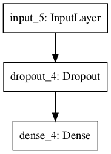
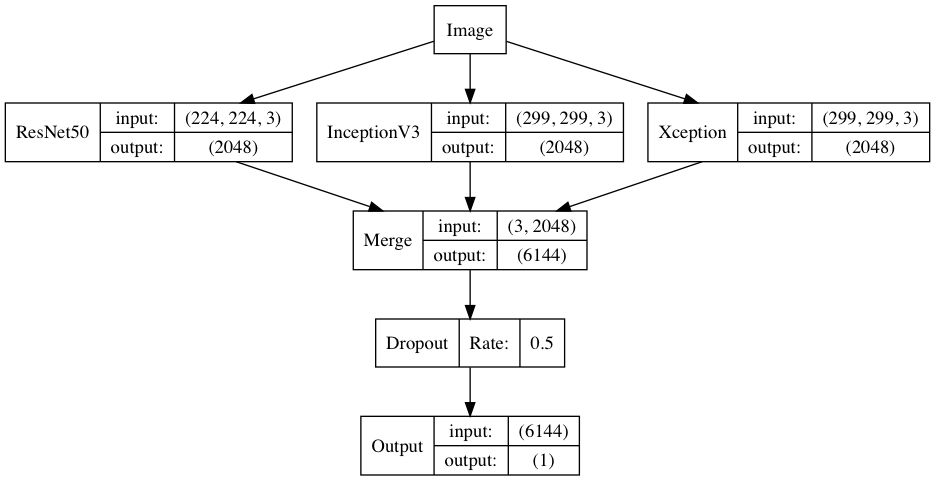

# 机器学习纳米学位
##毕业项目
 Fei.Gu 优达学城

2019年04月20日


## I. 问题的定义

### 项目概述

项目来源于 kaggle 在 2013 年组织的一场比赛，它使用25000张（约543M）猫狗图片作为训练集，12500张(约271M)图片作为测试集，数据都是分辨率400x400左右的小图片，目标是识别测试集中的图片是猫还是狗。

本项目属于计算机视觉中的图像分类问题。图像分类的目的是根据潜在的类别对特定的图像进行分类。图像分类的一个经典示例是在一组图像中识别猫和狗。

赛题网址：https://www.kaggle.com/c/dogs-vs-cats

数据集下载地址：[Dogs vs. Cats Redux: Kernels Edition](https://www.kaggle.com/c/dogs-vs-cats-redux-kernels-edition)


### 问题陈述
本文将介绍如何在图像分类问题中实施迁移学习解决方案。主要是使用"监督学习”实现一个图像分类器，来识别一张图片是猫还是狗。

对于图像识别，在数据量足量大的情况下，一般使用深度学习中的卷积神经网络（Convolutional Neural Networks, CNN），而本文将从迁移学习的角度，看看如何应用现有的深度学习模型（ResNet50、InceptionV3 和 Xception），从图片中提取特征，供分类器使用。使用此方法，即无需大量学习和训练模型的时间成本，又能解决图片识别相关的大多数问题。

本项目需要对测试样本进行分类，然后基于 CNN 的模型进行训练，并将结果上传至 kaggle 进行评分。

### 评价指标
对数损失（Log loss）亦被称为逻辑回归损失（Logistic regression loss）或交叉熵损失（Cross-entropy loss）。 交叉熵是常用的评价方式之一，它实际上刻画的是两个概率分布之间的距离，是分类问题中使用广泛的一种损失函数。
本文实际上是二分类问题， 因此可以采用 logloss 损失函数作为评价指标， 计算公式如下：


其中：

- n 是测试集中图片数量
- $$\hat{y}$$ 是图片预测为狗的概率
- $$y_i$$如果图像是狗，则为1，如果是猫，则为0
- $$\log( )$$ 是自然（ 基数$$^e$$）对数

采用交叉熵作为损失函数可以有效的解决梯度消失和梯度爆炸的问题。
交叉熵损失越小，代表模型的性能越好。上述评估指标可用于评估该项目的解决方案以及基准模型。


## II. 分析
### 数据的探索
此数据集可以从 kaggle 上下载。[Dogs vs. Cats Redux: Kernels Edition](https://www.kaggle.com/c/dogs-vs-cats-redux-kernels-edition/data)


下载 kaggle 猫狗数据集解压后分为 3 个文件 train.zip、 test.zip 和 sample_submission.csv。

train 训练集包含了 25000 张猫狗的图片，猫狗各一半，每张图片包含图片本身和图片名。命名规则根据 “type.num.jpg” 方式命名。

test 测试集包含了 12500 张猫狗的图片，没有标定是猫还是狗，每张图片命名规则根据 “num.jpg”，需要注意的是测试集编号从 1 开始，而训练集的编号从 0 开始。

sample_submission.csv 需要将最终测试集的测试结果写入.csv 文件中，上传至 kaggle 进行打分。

### 探索性可视化
在做计算机视觉的任务时，第一步很重要的事情是看看要做的是什么样的数据集，是非常干净的？还是存在各种遮挡的？猫和狗是大是小？图片清晰度一般怎么样？会不会数据集中有标注错误的数据，比例是多少？

- train 训练集包含了 25000 张猫狗的图片，平均宽=404px，平均高=360px，最小的宽=42px，最大宽=1050px，最小高=32px，最大高=768px；
- test 测试集包含了 12500 张猫狗的图片，平均宽=404px，平均高=359px，最小的宽=37px，最大宽=500px，最小高=44px，最大高=500px；
- 还可以通过opencv，找出模糊图片，原理就是使用了cv2.Laplacian()这个方法，代码如下。图片越模糊，imageVar的值越小，图像越模糊。
  参考代码：来源于：https://blog.csdn.net/u014642834/article/details/78532798

### 算法和技术


在这一部分，你需要讨论你解决问题时用到的算法和技术。你需要根据问题的特性和所属领域来论述使用这些方法的合理性。你需要考虑：

- _你所使用的算法，包括用到的变量/参数都清晰地说明了吗？_
- _你是否已经详尽地描述并讨论了使用这些技术的合理性？_
- _你是否清晰地描述了这些算法和技术具体会如何处理这些数据？_

### 基准模型
目前 Leaderboard 上展示了 1314 支队伍的成绩，排名第一的 score 是 0.03302，Top2% 的成绩是 0.04357。本项目的最低要求是 kaggle Public Leaderboard 前 10%，即 0.06149。

关于模型选型有以下三个方向：

- 1、普通的 CNN方法直接训练一个"基准模型"，依次建立卷积层、全连接层、sigmoid输出分类、通过keras.preprocessing.image.ImageGenerator 进行一系列随机变换堆数据进行提升，抑制过拟合。
有关 CNN 的知识，推荐：[Understanding of Convolutional Neural Network](https://medium.com/@RaghavPrabhu/understanding-of-convolutional-neural-network-cnn-deep-learning-99760835f148) 

  ```
  model.add(Dropout(0.5))
  model.add(Convolution2D(4, 5, 5,input_shape=(224, 224,3)))
  model.add(Activation('relu'))
  model.add(MaxPooling2D(pool_size=(2, 2)))
  ```

  ```
  model.compile(loss='binary_crossentropy',
                optimizer='rmsprop',
                metrics=['accuracy'])
  ```

- 2、站在巨人的肩膀，使用预训练好的 ResNet50 方法进行训练，融合ResNet50, Xception, InceptionV3 三大模型，训练速度快，准确率高。
推荐 ResNet 相关知识的好文章：

  - [Understanding and Coding a ResNet in Keras](https://towardsdatascience.com/understanding-and-coding-a-resnet-in-keras-446d7ff84d33)
  
  - [ImageNet: VGGNet, ResNet, Inception, and Xception with Keras](https://www.pyimagesearch.com/2017/03/20/imagenet-vggnet-resnet-inception-xception-keras/)
  
  ```
  inputs = Input(X_train.shape[1:])
  x = Dropout(0.25)(inputs)
  x = Dense(1, activation='sigmoid')(x)
  model = Model(inputs, x)
  
  model.compile(optimizer='adadelta', 
                loss='binary_crossentropy', 
                metrics=['accuracy'])
  ```



																						图一



																							图二

- 3、使用TensorFlow迁移学习，可选 VGG16 模型
有关VGG16的知识，推荐：[VGG16 – Convolutional Network for Classification and Detection](https://neurohive.io/en/popular-networks/vgg16/)


## III. 方法
### 数据预处理
在这一部分， 你需要清晰记录你所有必要的数据预处理步骤。在前一个部分所描述的数据的异常或特性在这一部分需要被更正和处理。需要考虑的问题有：
- _如果你选择的算法需要进行特征选取或特征变换，你对此进行记录和描述了吗？_
- _**数据的探索**这一部分中提及的异常和特性是否被更正了，对此进行记录和描述了吗？_
- _如果你认为不需要进行预处理，你解释个中原因了吗？_

### 执行过程
在这一部分， 你需要描述你所建立的模型在给定数据上执行过程。模型的执行过程，以及过程中遇到的困难的描述应该清晰明了地记录和描述。需要考虑的问题：
- _你所用到的算法和技术执行的方式是否清晰记录了？_
- _在运用上面所提及的技术及指标的执行过程中是否遇到了困难，是否需要作出改动来得到想要的结果？_
- _是否有需要记录解释的代码片段(例如复杂的函数）？_

### 完善
在这一部分，你需要描述你对原有的算法和技术完善的过程。例如调整模型的参数以达到更好的结果的过程应该有所记录。你需要记录最初和最终的模型，以及过程中有代表性意义的结果。你需要考虑的问题：
- _初始结果是否清晰记录了？_
- _完善的过程是否清晰记录了，其中使用了什么技术？_
- _完善过程中的结果以及最终结果是否清晰记录了？_


## IV. 结果
### 模型的评价与验证
在这一部分，你需要对你得出的最终模型的各种技术质量进行详尽的评价。最终模型是怎么得出来的，为什么它会被选为最佳需要清晰地描述。你也需要对模型和结果可靠性作出验证分析，譬如对输入数据或环境的一些操控是否会对结果产生影响（敏感性分析sensitivity analysis）。一些需要考虑的问题：
- _最终的模型是否合理，跟期待的结果是否一致？最后的各种参数是否合理？_
- _模型是否对于这个问题是否足够稳健可靠？训练数据或输入的一些微小的改变是否会极大影响结果？（鲁棒性）_
- _这个模型得出的结果是否可信？_

### 合理性分析
在这个部分，你需要利用一些统计分析，把你的最终模型得到的结果与你的前面设定的基准模型进行对比。你也分析你的最终模型和结果是否确确实实解决了你在这个项目里设定的问题。你需要考虑：
- _最终结果对比你的基准模型表现得更好还是有所逊色？_
- _你是否详尽地分析和讨论了最终结果？_
- _最终结果是不是确确实实解决了问题？_


## V. 项目结论
_（大概 1-2 页）_

### 结果可视化
在这一部分，你需要用可视化的方式展示项目中需要强调的重要技术特性。至于什么形式，你可以自由把握，但需要表达出一个关于这个项目重要的结论和特点，并对此作出讨论。一些需要考虑的：
- _你是否对一个与问题，数据集，输入数据，或结果相关的，重要的技术特性进行了可视化？_
- _可视化结果是否详尽的分析讨论了？_
- _绘图的坐标轴，标题，基准面是不是清晰定义了？_


### 对项目的思考
在这一部分，你需要从头到尾总结一下整个问题的解决方案，讨论其中你认为有趣或困难的地方。从整体来反思一下整个项目，确保自己对整个流程是明确掌握的。需要考虑：
- _你是否详尽总结了项目的整个流程？_
- _项目里有哪些比较有意思的地方？_
- _项目里有哪些比较困难的地方？_
- _最终模型和结果是否符合你对这个问题的期望？它可以在通用的场景下解决这些类型的问题吗？_


### 需要作出的改进
在这一部分，你需要讨论你可以怎么样去完善你执行流程中的某一方面。例如考虑一下你的操作的方法是否可以进一步推广，泛化，有没有需要作出变更的地方。你并不需要确实作出这些改进，不过你应能够讨论这些改进可能对结果的影响，并与现有结果进行比较。一些需要考虑的问题：
- _是否可以有算法和技术层面的进一步的完善？_
- _是否有一些你了解到，但是你还没能够实践的算法和技术？_
- _如果将你最终模型作为新的基准，你认为还能有更好的解决方案吗？_

----------
** 在提交之前， 问一下自己... **

- 你所写的项目报告结构对比于这个模板而言足够清晰了没有？
- 每一个部分（尤其**分析**和**方法**）是否清晰，简洁，明了？有没有存在歧义的术语和用语需要进一步说明的？
- 你的目标读者是不是能够明白你的分析，方法和结果？
- 报告里面是否有语法错误或拼写错误？
- 报告里提到的一些外部资料及来源是不是都正确引述或引用了？
- 代码可读性是否良好？必要的注释是否加上了？
- 代码是否可以顺利运行并重现跟报告相似的结果？
